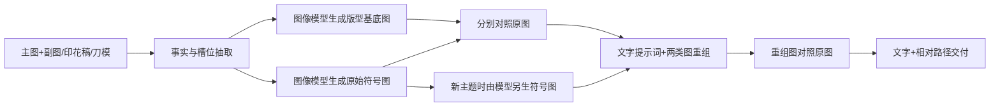

# 多模态版型 + 符号架构（1.3）

## 目标与边界

`产品属性 = 功能属性 + 符号属性`；`产品设计候选 = 版型 + 符号方案`；`生成图 = 产品设计候选 + 画面协议`。这里的“+”表示按槽位、部件关系和工艺边界进行组合，不能理解为任意拼贴。

- **版型**是可复用的产品款式/结构底座，不限于二维纸样或外轮廓；记录模块/部件及其关系、功能、单套组成与各部件件数、尺寸、材料、固定外观、印花载体和已知生产约束。版型库可以把可复用部件整理为标准模块，再按兼容规则组合成款式；不为标准化而抹掉必要的功能或制造差异。
- **符号方案**是可替换的视觉与语义层，记录主题元素、图形、文字、字体、印刷色、排布、风格、情绪表达及已知的权利状态。符号必须适配版型提供的载体、印花区域和已知工艺限制。
- **款式矩阵**可理解为 `版型库 × 符号库 → 候选款`。理论组合数不等于可开发数量；每个候选都要检查部件兼容性、承印能力、供应工艺、成本、质量、合规/知识产权与目标市场需求。
- **可量产/可上市状态**需要打样、BOM/成本、质量与合规等相应证据。本 Skill 交付的是可追溯的视觉方案、提示词和图像复测结果；没有这些证据时，结果标为视觉候选，不声称已可生产或已获市场验证。

版型与符号均为**文字 + 图像**资产。提取图由图像模型参考原商品图、设计稿或刀模生成；原图保留为独立证据，生成图不能替代原图。版型图是生图参考，不是生产级刀模或印花源文件。画面协议按主图、副图或 A+ 分开。换主题生成整套新图时，主图继承已核对的主图画面协议；**用户确认新主图后**，副图才另按主题制定新画面计划。详细接口见 [Gen 流程](gen-workflow.md)。



## 三份契约与图片角色

| 契约 | 文字锁定内容 | 模型生成图 | 换主题时 |
|---|---|---|---|
| 产品版型 | 可复用模块/部件及其关系、功能、单套组成和件数、尺寸、结构、材质、固定底色/边带、已知工艺限制；各印花区的载体、位置、尺寸、方向和密度 | `TEMPLATE`：无原主题印花的产品基底图；必要时另有区域蒙版 | 图与文字保持同一版本；若改模块配置、件数、功能、外形或印花载体布局则建新版型 |
| 符号包 | 每个槽位的主题图案、文案、数字、可变印刷色、排布/风格及已知权利状态 | `SYMBOLS_ORIGINAL` 或 `SYMBOLS_NEW`：分区符号图或逐槽图 | 由图像模型生成新符号图，并同步修改槽位文字；须适配版型和已知工艺边界 |
| 画面协议 | 用途、纵横比、机位、折叠状态、摆放、遮挡、背景和光线 | 可直接体现于版型基底图 | 同一对比实验中固定；新画面另建版本 |

一个槽位至少有名称、载体、物理/相对边界、排布规则及允许改变的内容。B0H5HSBY72 的 `TOWEL_A_REPEAT` 是绿巾满版印花，`TOWEL_B_SCRIPT`、`TOWEL_B_ICON`、`TOWEL_B_BLOCK` 共处白巾局部徽章，`CARD_FRONT_PRINT` 是卡面印刷。橄榄球形的**卡片裁切边缘**留在版型；卡面球纹属于符号。想换卡片外形时升级版型。

套装件数属于版型配置，应明确“每套含哪些部件、各几件”；“本次要生成多少张图/多少个设计候选”属于任务参数。B0H5HSBY72 的基线配置记录为每套两条毛巾和一张贺卡。增加或减少套内物件、改变部件之间的结构关系时，应建立新的版型或配置版本；仅替换印花内容时保留版型版本。

符号图应同时表达**内容与定位**。松散素材图能说明图案是什么，却没有可靠的产品尺度，不能单独承担高保真重组；若要控制占比，让图像模型生成按目标画面配准的符号定位图，标明可见印花的相对位置、面积、稀疏程度和留白。B0H5HSBY72 的主图基线中，两条折叠毛巾的符号定位图修正了松散素材图造成的图案过密与徽章位置偏差。配准图仍只是模型生成结果，重组模型也可能把徽章放大，应结合文字和复测。若要求符号槽外保持一致，需以已核对的基底进行受区域限制编辑或合成，再核查实际输出；没有相应能力时将整图生图结果标为近似概念图。

## 提取和复测顺序

1. 选择来源：用户指定来源优先；有 ASIN 且未指定时查看 Amazon 前台。保存主图和可得副图，逐张登记看到了什么、能补主图什么盲区。主图决定本次画面构图与评分目标；副图核实印花、布料、折法和配件，先蒸馏再进入提示词，不直接给盲测代理。设计稿决定展开设计几何，listing/ERP 说明售卖字段；冲突记 `disputed`。
2. 文字拆分后，图像模型分别生成版型图与符号图。版型图消除原主题，但保留真实物件数和印花区载体；符号图按区域隔开，保留原文案和图形尺度。原设计图、商品图、刀模均可作输入，但给模型说明各图角色；刀模画板不能变成成品边缘。
3. **抽取门槛**：逐图对照原来源。先记录可测的物理尺寸比与印花面积比，再核对生成版型的物件、轮廓、相对尺寸、固定色和纹理，且原主题没有泄漏；符号图核对图案种类/数量/密度、颜色、拼写和版面。即使文字提示词给出正确数字，生成版型本身的尺寸比错误也不能通过。错误图保持草稿状态，针对差异重新生成。
4. **基线重组门槛**：只把已抽取的版型图、原始符号图与合成提示词输入生图模型；原图只作对照，不作为该次重组的隐藏条件。重组结果与原图/设计稿逐项比较，记录印花占比、裁切轮廓、件数、文字及未验证项。新主题主图采用同一版型图和主图画面协议，只替换符号图与文字；新主题副图从同一产品版型和新符号出发另行规划，不沿用旧副图场景。
5. 需要“图中除符号外一致”时，优先在基底图上限制印花区域局部编辑，并保存模型生成且已核对的区域图/蒙版。仅用从零生图很难锁定非符号像素。概念图不能证明材料性能或实物可投产。

90% 是[复测协议](evaluation-protocol.md)中的双门槛目标，而不是模型生成保证。源图与生成图都应保留；失败不能靠改分数或只挑最好的一张掩盖。

## 提示词文件与本地图片

`prompt.md` 是多模态交付文件，包含：

1. **可复制文字提示词**：一个独立代码块，无空槽，直接写入 `TEMPLATE = images/...`、`SYMBOLS_ORIGINAL = images/...` 等角色与相对路径。网页端复制文字并上传对应图片；桌面 Agent 以 `prompt.md` 所在目录解析路径、实际读取图片。
2. **图片路径清单**：相对 `images/` 的路径、角色、MIME、SHA-256；文件头记录包版本和整体复测状态，逐图问题记录在 `review.md`。
3. **使用说明**：明确 Agent 必须把路径指向的文件作为图像输入；路径文字本身不是图像。通过 [打包脚本](../scripts/build_prompt.py)生成文件并校验图片存在、MIME 与哈希；图片变化后重新生成路径表。

桌面 Agent 默认读取 `prompt.md` 和对应图片。移动包时保持 `prompt.md` 与 `images/` 的相对位置；若 Agent 运行在无法访问该目录的主机，需要把两张图片文件同步到它能读取的位置。重组结果图放在 `manual-runs/` 供对比，不作为下一次提示词的默认输入。网页端与桌面 Agent 的操作见[手动测试指南](manual-test-guide.md)。

```text
product-visuals/<产品ID>/
├── templates/product-template.v*.md       # 版型文字
├── symbols/<主题>.v*.md                    # 符号文字
├── shot-profiles/<画面类型>.v*.md           # 画面文字
└── extractions/<版本>/
    ├── images/
    │   ├── template-base.png               # 模型生成的版型图
    │   └── symbols-original-atlas.png      # 模型生成的符号图或定位图
    ├── manual-runs/                          # 独立重组结果、实际输入及哈希日志
    ├── prompt-text.md                      # 可编辑的复制区原文
    ├── prompt.md                           # 文字 + 图片相对路径及哈希
    └── review.md                           # 与原图对照、状态与误差
```

既有 `specs/` 和旧 JSON schema 是历史单提示词研究记录，不能验证上述多模态契约。上游材料索引由具体产品项目单独维护；本 Skill 可独立安装。
